{width="0.5236111111111111in"
height="0.5847211286089239in"}

**instructables**

{width="0.5097222222222222in"
height="0.5097211286089239in"}

> by
> {width="7.527777777777778in"
> height="0.6805555555555556in"}
>
> This is a Smart Door Lock System which uses Arduino Bluetooth and A
> Smartphone Application as a Fingerprint Authenticator.
>
> **This Project is namedas \" as \"\".\".**
>
> **Bene�ts:-**
>
> is designed to perform locking and unlocking operations on a door when
> it receives such instructionsfrom an authorized device using a
> wireless protocol. This is a Smart Door Lock System which uses Arduino
> Bluetooth And A Smartphone Application as a Fingerprint Authenticator.
> To ensure safety, the Lock will **unlock unlock** only when you
> **place Finger which you use to unlock your device** and your door
> lock will **unlock unlock** for **4 Seconds Only 4 Seconds Only**.
> (Locks after 4seconds automatically). It will also not work if there
> are three consecutive unauthorized attempts.
>
> By following this guide, you will be able to know and make your **..**
> This project guide contains the �les

necessary to help you step by step produce your own **..** Please follow
the steps of the project to get a

> positive result.
>
> **Supplies:**
>
> Get all the Components Listed in images.

Smart Door Lock: Page 1

{width="7.477777777777778in"
height="5.608333333333333in"}

> **Step 1: Get Your PCB Ready!**

**Talking about electronics.**

{width="0.1388888888888889in"
height="0.1388888888888889in"}

> After making the circuit diagram I transformed it into a PCB design to
> produce it, to produce the PCB, I have chosen the best PCB supplier
> and the cheapest PCB provider to order my circuit. with
> the{width="7.527777777777778in"
> height="0.8888888888888888in"}
>
> reliable platform, all I need to do is some simple clicks to upload
> the Gerber �le and set some parameters like the PCB thickness color
> and quantity. I've paid just 2 Dollars to get my PCB after �ve days
> only, what I have noticed about this time is the \"out-of-charge PCB
> color\" which means you will pay only 2USD for any PCB color you
> choose.

**Related Download Files**\
As you can see in the pictures above the PCB is very well manufactured
and I've got the same PCB design that we've made for our main board and
all the labels and logos are there to guide me during the soldering
steps. You can also download the Gerber �le for this circuit from the
download link below in case you want to place an order for the same
circuit design.

Smart Door Lock: Page 2

{width="7.477777777777778in"
height="4.208333333333333in"}

{width="7.477777777777778in"
height="4.208333333333333in"}

Smart Door Lock: Page 3

{width="7.477777777777778in"
height="4.208333333333333in"}

**Step 2: Get All the Components Listed in Images.**

> Get all the Components Listed in images.

{width="7.477777777777778in"
height="4.208332239720035in"}

Smart Door Lock: Page 4

{width="7.477777777777778in"
height="4.208333333333333in"}

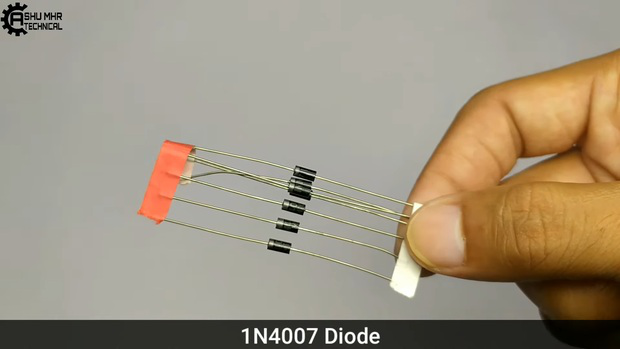{width="7.477777777777778in"
height="4.208333333333333in"}

Smart Door Lock: Page 5

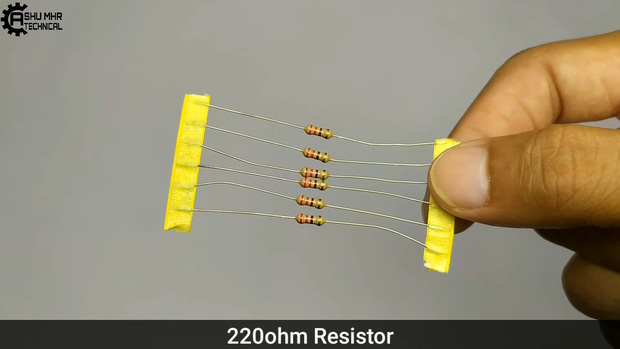{width="7.477777777777778in"
height="4.208333333333333in"}

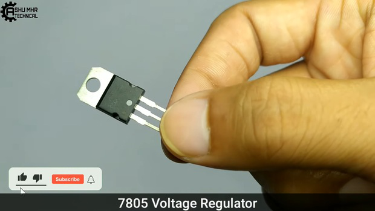{width="7.477777777777778in"
height="4.208333333333333in"}

Smart Door Lock: Page 6

{width="7.477777777777778in"
height="4.208333333333333in"}

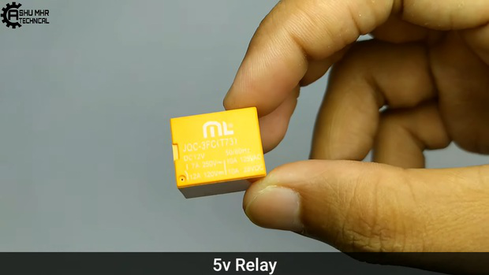{width="7.477777777777778in"
height="4.208333333333333in"}

Smart Door Lock: Page 7

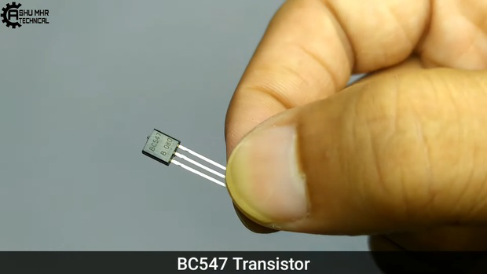{width="7.477777777777778in"
height="4.208333333333333in"}

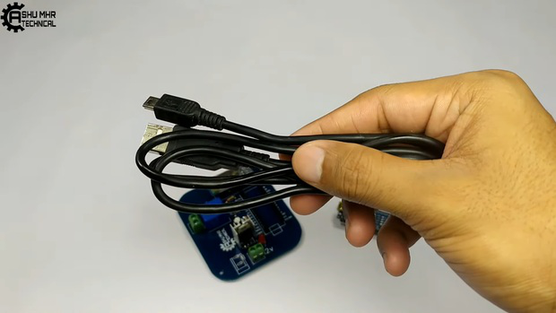{width="7.477777777777778in"
height="4.208333333333333in"}

Smart Door Lock: Page 8

{width="7.477777777777778in"
height="4.208333333333333in"}

{width="7.477777777777778in"
height="4.208333333333333in"}

Smart Door Lock: Page 9

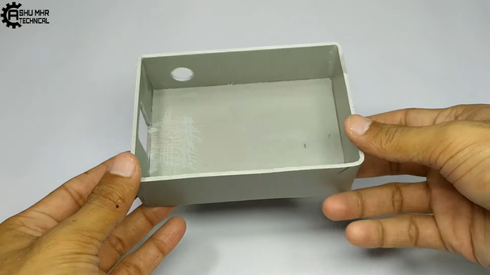{width="7.477777777777778in"
height="4.208333333333333in"}

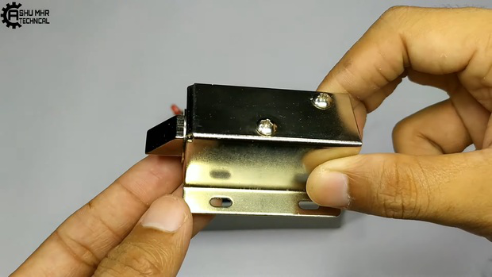{width="7.477777777777778in"
height="4.208333333333333in"}

Smart Door Lock: Page 10

{width="7.477777777777778in"
height="4.208333333333333in"}

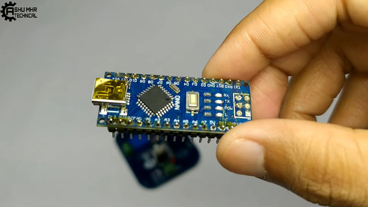{width="7.477777777777778in"
height="4.208333333333333in"}

**Step 3: Place All the Components on PCB.**

> Place All The Components On PCB And Solder It Properly.

Smart Door Lock: Page 11

{width="7.477777777777778in"
height="4.208333333333333in"}

{width="7.477777777777778in"
height="4.208333333333333in"}

Smart Door Lock: Page 12

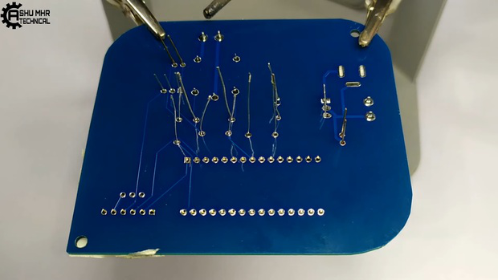{width="7.477777777777778in"
height="4.208333333333333in"}

{width="7.477777777777778in"
height="4.208333333333333in"}

Smart Door Lock: Page 13

{width="7.477777777777778in"
height="4.208333333333333in"}

**Step 4: Uploading Code to Arduino Nano**

{width="0.1388888888888889in"
height="0.375in"}

{width="0.1388888888888889in"
height="0.1527777777777778in"}

> Connect the programming cable to Arduino Nano And PC.
>
> Paste the code given and Upload the code.
>
> **Note:** 1) **Make sure Arduino is not connected with the circuit
> before coding, as it may lead to error. Make sure Arduino is not
> connected with the circuit before coding, as it may lead to error.**
>
> 2\) Before Uploading the code select the desired **COM Port COM Port**
> and **Board Type to Arduino Nano.**

Smart Door Lock: Page 14

{width="7.477777777777778in"
height="4.208333333333333in"}

{width="7.477777777777778in"
height="4.208333333333333in"}

Smart Door Lock: Page 15

{width="7.477777777777778in"
height="4.208333333333333in"}

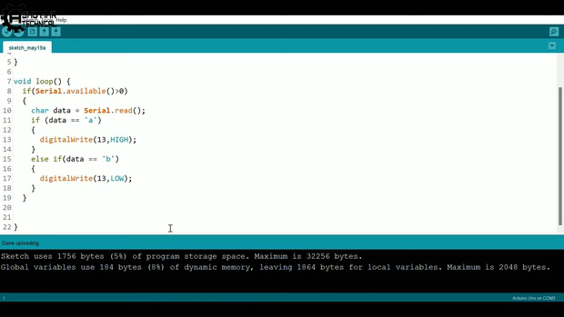{width="7.477777777777778in"
height="4.208333333333333in"}

Smart Door Lock: Page 16

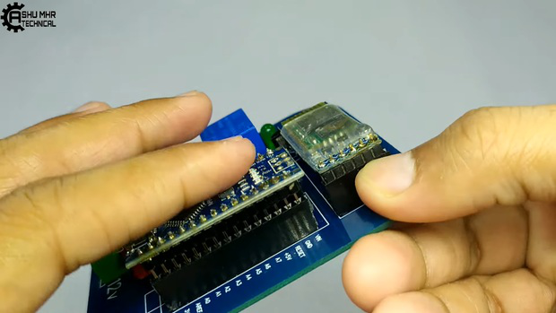{width="7.477777777777778in"
height="4.208333333333333in"}

**Step 5: Place HC-05 Bluetooth Module.**

> Place HC-05 Bluetooth Module And Make Custom Designed Pvc Box.

{width="7.477777777777778in"
height="4.208332239720035in"}

Smart Door Lock: Page 17

{width="7.477777777777778in"
height="4.208333333333333in"}

{width="7.477777777777778in"
height="4.208333333333333in"}

Smart Door Lock: Page 18

{width="7.477777777777778in"
height="4.208333333333333in"}

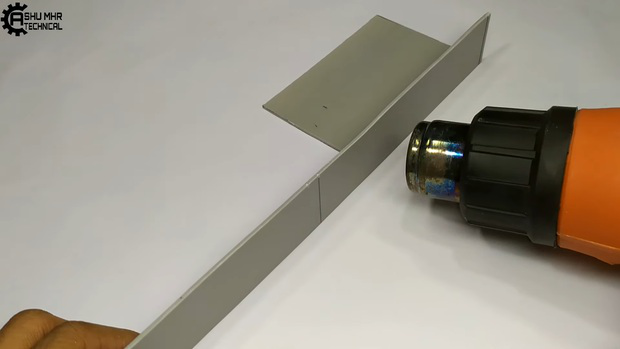{width="7.477777777777778in"
height="4.208333333333333in"}

Smart Door Lock: Page 19

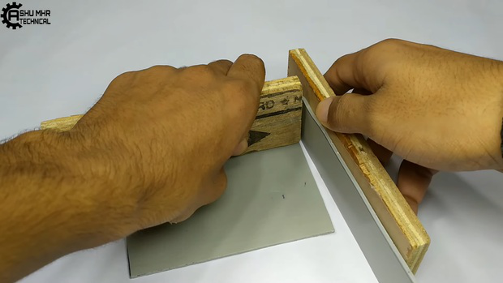{width="7.477777777777778in"
height="4.208333333333333in"}

{width="7.477777777777778in"
height="4.208333333333333in"}

Smart Door Lock: Page 20

{width="7.477777777777778in"
height="4.208333333333333in"}

**Step 6: Connection of Solenoid Lock and DC Jack.**

{width="0.1388888888888889in"
height="0.375in"}

> Connect the **+(ve) Red wire +(ve) Red wire** of solenoid to the
> **Left side screw terminal in front of Relay.**
>
> Connect the **-(ve) Black wire-(ve) Black wire** of solenoid to the
> **Right side screw terminal of 12v**
>
> Connect a wire from **right side of screw terminal in front of Relay
> to the Left side of screw terminal**

{width="0.1388888888888889in"
height="0.1527777777777778in"}

{width="0.1388888888888889in"
height="0.1527777777777778in"}

> **of 12v**.
>
> **Note:** Please follow the image to get more clear idea about the
> connections.
>
> Connect the female DC Jack **+(ve) to +(ve) (left side of 12v screw
> teminal) +(ve) to +(ve) (left side of 12v screw teminal)** and **-(ve)
> to -(ve) (Rightside of 12v screw terminal**).
>
> Place All the Circuit and cover the box.

Smart Door Lock: Page 21

{width="7.477777777777778in"
height="4.208333333333333in"}

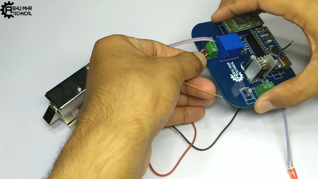{width="7.477777777777778in"
height="4.208333333333333in"}

Smart Door Lock: Page 22

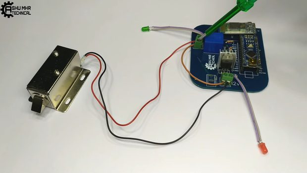{width="7.477777777777778in"
height="4.208333333333333in"}

{width="7.477777777777778in"
height="4.208333333333333in"}

Smart Door Lock: Page 23

{width="7.477777777777778in"
height="4.208333333333333in"}

{width="7.477777777777778in"
height="4.208333333333333in"}

Smart Door Lock: Page 24

{width="7.477777777777778in"
height="4.208333333333333in"}

> **Step 7: Now Your Own Smart Door Lock Is Ready to Use.**
>
> **Testing:**

{width="0.1388888888888889in"
height="0.3611111111111111in"}

{width="0.1388888888888889in"
height="0.1388888888888889in"}

> **Connect** the **12v DC adapter, 12v DC adapter,** red power led will
> indicate on device.
>
> Open the application on your Smartphone, **connect connect** the
> **HC-05 Bluetooth HC-05 Bluetooth** Module with **app app**.(**If you
> are connecting HC-05 for the �rst time, It will ask for a password
> which is usually \"0000\" OR \"1234\"**) Now, whenever you want to
> unlock the **,,** Click on the �ngerprint icon and then place

your �nger which you use to unlock your device and your door lock will
**unlock unlock** for **4 Seconds Only**

{width="0.1388888888888889in"
height="0.1388888888888889in"}

> (Locks after 4 seconds automatically)\
> **Note**: The Lock will **unlock unlock** only when you **place Finger
> which you use to unlock your device.**
>
> also **not work not work** if there are **three consecutive
> unauthorized attempts.**
>
> **New users will also get some coupons while registering atvia this
> blue link.**
>
> **Thank you for reading this guide, hopefully**, **this guide provides
> full steps to help you to create your this guide provides full steps
> to help you to create your**

**own..If you have any questions please post them in the comment section
below.**

Smart Door Lock: Page 25

{width="7.477777777777778in"
height="4.208333333333333in"}

{width="7.477777777777778in"
height="4.208333333333333in"}

Smart Door Lock: Page 26

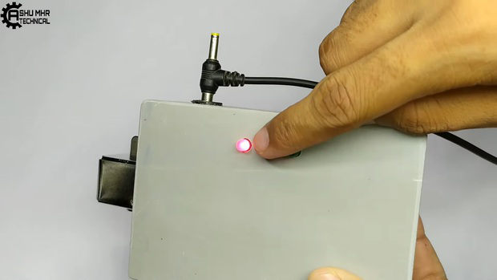{width="7.477777777777778in"
height="4.208333333333333in"}

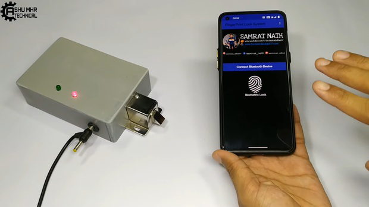{width="7.477777777777778in"
height="4.208333333333333in"}

Smart Door Lock: Page 27

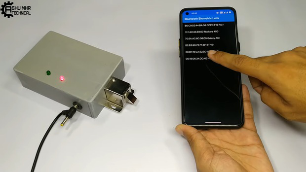{width="7.477777777777778in"
height="4.208333333333333in"}

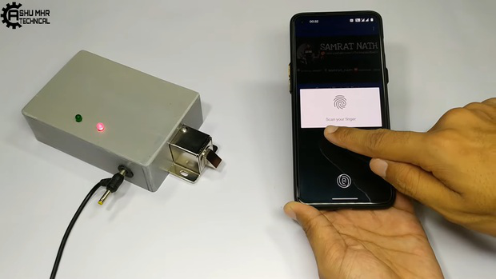{width="7.477777777777778in"
height="4.208333333333333in"}

Smart Door Lock: Page 28

{width="7.477777777777778in"
height="4.208333333333333in"}

{width="7.477777777777778in"
height="4.208333333333333in"}

Smart Door Lock: Page 29

{width="7.477777777777778in"
height="4.208333333333333in"}

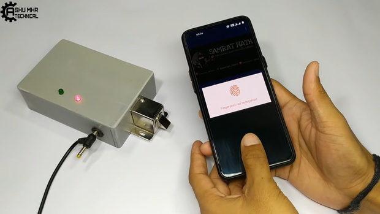{width="7.477777777777778in"
height="4.208333333333333in"}

Smart Door Lock: Page 30

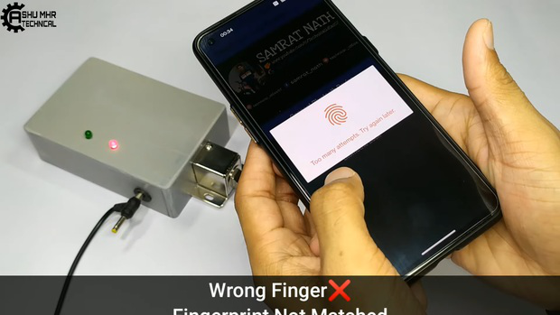{width="7.477777777777778in"
height="4.208333333333333in"}

{width="7.477777777777778in"
height="4.208333333333333in"}

Smart Door Lock: Page 31
